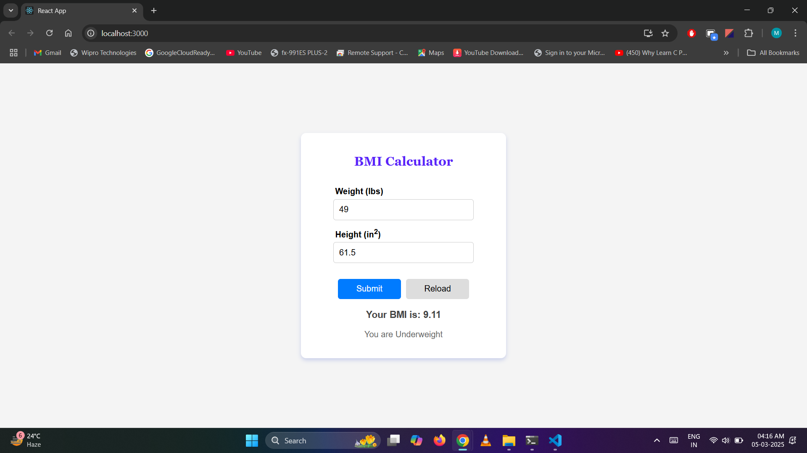
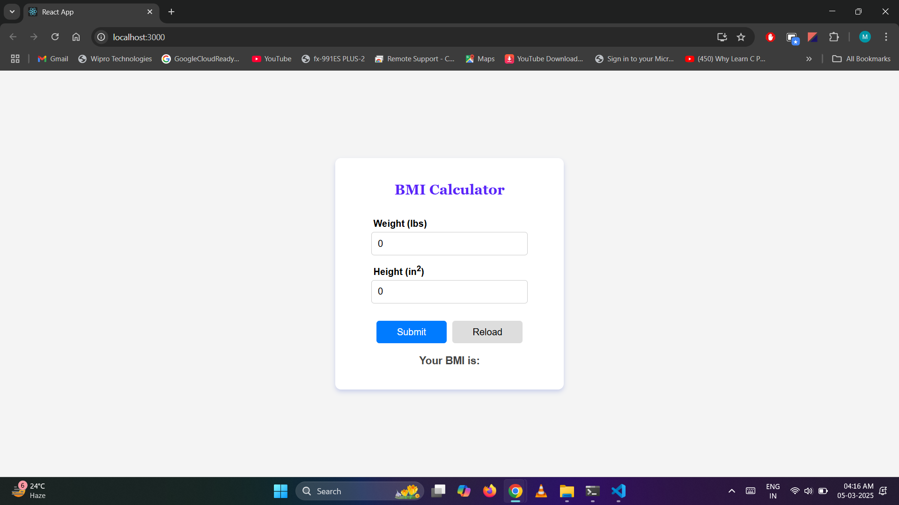

# BMI Calculator - React Project

This is a simple **BMI (Body Mass Index) Calculator** built using React.js. It allows users to enter their weight (in lbs) and height (in inches) to calculate their BMI and determine their weight category.

## 🚀 Features

- Calculates BMI based on weight and height.
- Displays messages like **Underweight, Normal, Overweight, or Obese**.
- Provides a **Reload** button to reset inputs.
- Fully **responsive** UI.

## 🛠️ Technologies Used

- **React.js**: Used for building the interactive UI and managing state.
- **JavaScript**: Handles the logic for BMI calculation and event handling.
- **CSS**: Provides styling and ensures a responsive layout for different screen sizes.

## 🌐 Live Link

🔗 Click here to use the [BMI Calculator]() 🚀

## 🖥️ Screenshot

**BMI Calculation Output:**


**Reload Page:**


## 🤝 Contributing

Feel free to submit issues or pull requests. Let's make this project better together! 😊

## 📦 Installation

Clone the repository and install dependencies:

```sh
git clone https://github.com/MuskanPriyaSingh/BMI_Calculator_React.git
cd BMI_Calculator_React
npm install
npm start
```
